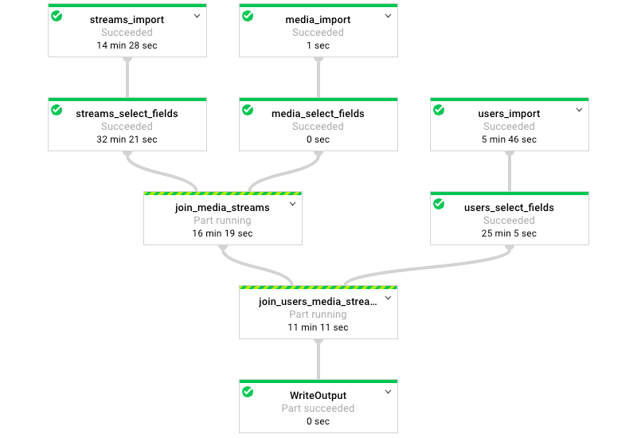
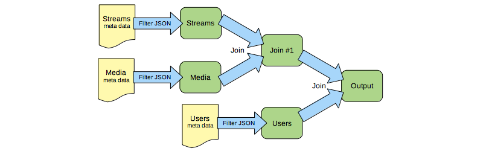
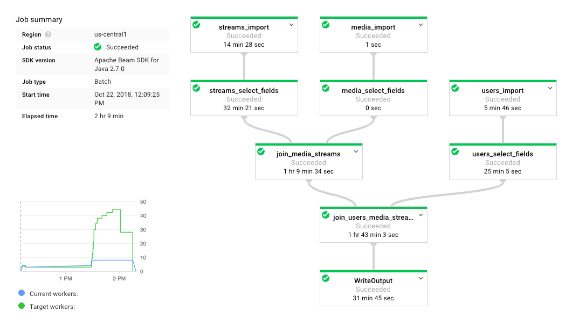

# Netflix Data Simulation
*github.com/heerman*





# About

I wrote this originally for a java coding interview.

The goal was to demonstrate Google Cloud Platform for large data pipelines, so I processed data at the scale of a Netflix-sized database. (**TLDR; took 2h 9min, costing $0.85**)


# Overview

* Netflix (2018): **5000** titles, **130 million** users, **140 million** streams/day

* Question: How long to combine data from all 3?

* Data: Fake data generated by me from popular IMDB entries


# Pipeline

Written with the Apache Beam Java SDK, this pipeline performs 2 relational joins between 3 compressed JSON datasets (aka denormalize data).




These are the fields of interest to us:

* Media: `message` `version` `user_id` `media_id` `timestamp` `length_min` `device_type` `os`

* Streams: `media_id` `primaryTitle` `runtimeMinutes` `startYear` `genres` `titleType`

* Users: `user_id` `country` `gender` `birth_year` `access`


## Results

Google Cloud gives you this interesting graph of "workers" ramping up.




Total Time Pipeline Processing: **2 hours 9 minutes**


```
Dataset Size (Count of JSON Entries): Users-130 million, Streams-140 million, Media-5000

Total Pipeline time:         2h 9min
Total vCPU time (vCPU hr):   10.058 ($0.57)
Total memory time (GB hr):   37.719 ($0.14)
Total PD time (GB hr):     2514.588 ($0.14)

Cloud Storage-Datasets (GB): 10.0   ($0.27 per month)
```

The job cost **$0.85**, plus about $0.01 per day for cloud storage of our datasets.
