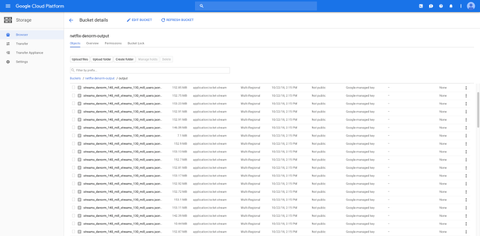
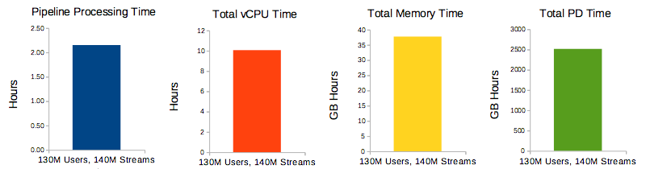

# How Big is a *Netflix-sized* Data Lake?
*github.com/heerman*


## Concept

Have you ever wondered how much data the **big boys of big data** are processing with their data lakes, ETLs, cloud buckets, and whatever other new technology of today??

For the curious minded - I've **simulated a daily ETL pipeline** that **Netflix** might use.


### An ETL Pipeline, via Google Cloud Platform, using Netflix-sized Datasets

* Question: How long will it take to **combine all that data** during the daily data denormalization?

* Netflix Database Stats (2018): **5000** titles, **130 million** users, **140 million** streams/day


## Dataset and Pipeline Overview

The data for this project was *simulated*, and is not actually from any Netflix databases.  JSON data entries were generated using a combination of random data and IMDB exports


### Dataset

* Each entry contains meta data about Netflix media, users, or a single video stream.

    * JSON format, compressed with GZIP

* I've posted a mini dataset that you can use to get started

    * https://github.com/heerman/netflix-streams-denorm/blob/master/netflix-media-simulated.json

    * https://github.com/heerman/netflix-streams-denorm/blob/master/netflix-streams-simulated.json

    * https://github.com/heerman/netflix-streams-denorm/blob/master/netflix-users-simulated.json

* Example from *netflix-media-simulated.json*
```json
{"genres": "Action,Drama,Thriller", "media_id": "tt1492179", "version": "3", 
"startYear": "2010", "runtimeMinutes": "45", "originalTitle": "Strike Back", 
"endYear": "2018", "primaryTitle": "Strike Back", "message": "APIMedia", 
"titleType": "tvSeries", "isAdult": "0"}
```

* Example from *netflix-streams-simulated.json*
```json
{"media_id": "tt1492179", "timestamp": "2018-09-27 18:27:40 UTC", 
"length_min": "217", "version": "3", "device_type": "tablet", "streamid": 
"1baf5bb4-6723-4f5f-9d65-38466ac115f0", "user_id": 
"12ca647b-3aaa-4fb1-9eb3-97555a0025b0", "message": "APIStream", "os": "iOS"}
```

* Example from *netflix-users-simulated.json*
```json
{"user_id": "12ca647b-3aaa-4fb1-9eb3-97555a0025b0", "country": "US", "access": 
"paid", "version": "3", "gender": "female", "message": "APIUser", "type": 
"streaming", "birth_year": "1991"}
```

* These are the only fields of interest to us:

    * Media: `message` `version` `user_id` `media_id` `timestamp` `length_min` `device_type` `os`

    * Streams: `media_id` `primaryTitle` `runtimeMinutes` `startYear` `genres` `titleType`

    * Users: `user_id` `country` `gender` `birth_year` `access`


* Example of expected denomalized output:
```json
{
  "message":"APIStream",
  "version":"3",
  "user_id":"12ca647b-3aaa-4fb1-9eb3-97555a0025b0",
  "media_id":"tt0041866",
  "timestamp":"2018-08-07 06:34:16 UTC",
  "length_min":"34",
  "device_type":"phone",
  "os":"Windows",
  "primaryTitle":"She Wore a Yellow Ribbon",
  "runtimeMinutes":"104",
  "startYear":"1949",
  "genres":"Western",
  "titleType":"movie",
  "country":"US",
  "gender":"male",
  "birth_year":"1986",
  "access":"paid"
}
```

### Pipeline

* Written with the Apache Beam Java SDK, this pipeline performs 2 relational joins between 3 compressed JSON datasets.


## Source Code

Updated docs and code can be found on github

* [https://github.com/heerman/netflix-denorm-etl/blob/master/NetflixStreamsDenorm.java](https://github.com/heerman/netflix-denorm-etl/blob/master/NetflixStreamsDenorm.java)


## Installation & Environment Setup


### 1. Setup Google Account for Google Cloud Platform

1. Configure Google Cloud Platform as described by the Google tutorial (and outlined below)

    * https://cloud.google.com/dataflow/docs/quickstarts/quickstart-java-maven

2. Sign up for an account on cloud.google.com, if you don't have a Google account

3. Create a GCP project

4. Enable billing (aka give Google your credit card)

    * *As of Oct 2018 you get you can sign up for a free trail, which includes a $300 credit*

5. Enable APIs

    * `Cloud Dataflow`, `Compute Engine`, `Stackdriver Logging`, `Google Cloud Storage`, `Google Cloud Storage JSON`, `BigQuery`, `Google Cloud Pub/Sub`, `Google Cloud Datastore`, `Google Cloud Resource Manager`

    * Shortcut from GCP Tutorial: https://console.cloud.google.com/flows/enableapi?apiid=dataflow,compute_component,logging,storage_component,storage_api,bigquery,pubsub,datastore.googleapis.com,cloudresourcemanager.googleapis.com&_ga=2.37189155.-241666662.1536164373

6. Create JSON credentials for service account, so apps can reach your storage bucket

    * Menu -> APIs & Services -> Credentials -> Credentials -> Create Credentials -> Service Account Key

        * Service Account: New service account

        * Service Name: *anything*

        * Role: Project -> Owner

        * Create JSON

7. Set environmental variable `GOOGLE_APPLICATION_CREDENTIALS`

    * `GOOGLE_APPLICATION_CREDENTIALS=/path/to/json/credential/file.json`

8. Create 2 Google storage buckets

    * Menu -> Storage -> Browser

    * Click "Create bucket" to create bucket 1

        * Name: *something like 'netflix-denorm-output'*

        * Default storage class: Mutli-Regional

        * Create

    * Back (Left Arrow)

    * Click "Create bucket" to create bucket 2

        * Name: *something like 'netflix-dataset'*

        * Default storage class: Mutli-Regional

        * Create

    * Click "Upload File" within *netflix-dataset*

        * Upload JSON records for `netflix-streams.json.gz`

        * Upload JSON records for `netflix-media.json.gz`

        * Upload JSON records for `netflix-users.json.gz`

    * *(Optional)* Make data in google cloud buckets publicly accessible

        * Bucket navigator -> find file -> … -> Edit Permissions -> Add +

            * Entity: User

            * Name: allUsers

            * Access: Reader

        * https://cloud.google.com/storage/docs/access-control/making-data-public




### 2. Apache Beam Setup - Java SDK

1. Install Java JDK 8

    * https://www.oracle.com/technetwork/java/javase/downloads/jdk8-downloads-2133151.html

2. Download Apache Maven, Uncompress

    * https://maven.apache.org/download.cgi

    * `tar -zxf apache-maven-3.5.4.tgz`

    * `alias mvn=apache-maven-3.5.4/bin/mvn`

3. Set the JAVA_HOME environmental variable for mvn

  * `export JAVA_HOME=/path/to/jdk`

4. Download Apache Beam and the WordCount example code via Maven

    * https://beam.apache.org/get-started/quickstart-java/

```bash
mvn archetype:generate \
      -DarchetypeGroupId=org.apache.beam \
      -DarchetypeArtifactId=beam-sdks-java-maven-archetypes-examples \
      -DarchetypeVersion=2.7.0 \
      -DgroupId=org.example \
      -DartifactId=word-count-beam \
      -Dversion="0.1" \
      -Dpackage=org.apache.beam.examples \
      -DinteractiveMode=false
```

5. Run WordCount to Verify Installation

    * Use the default input (King Lear full text hosted by GCP), and write the output to local files `output-0000X`

```bash
cd word-count-beam

mvn compile exec:java \
      -Dexec.mainClass=org.apache.beam.examples.WordCount \
      -Dexec.args="--output=./output/"
```


### 3. Load Pipeline Java Class

1. Copy NetflixStreamsDenorm.java to the example directory

    * `cp NetFlixStreamsDenorm.java word-count-beam/src/main/java/org/apache/beam/examples`

2. You are now to run your Apache Beam pipeline with Google Dataflow runner, and Google Cloud Storage Buckets


### 4. Execute the pipeline in Google Cloud Platform

* As you run your pipeline with `mvn`, you can watch the progress from cloud.google.com

```bash
export GOOGLE_APPLICATION_CREDENTIALS=/path/to/json/credential/file.json

mvn compile exec:java \
      -Pdataflow-runner \
      -Dexec.mainClass=org.apache.beam.examples.NetflixStreamsDenorm \
      -Dexec.args="\
        --runner=DataflowRunner \
        --project=heerman-gcp \
        --input_streams=gs://netflix-dataset/netflix-streams.json.gz \
        --input_media=gs://netflix-dataset/netflix-users.json.gz \
        --input_users=gs://netflix-dataset/netflix-media.json.gz \
        --stagingLocation=gs://netflix-denorm-output/staging \
        --gcpTempLocation=gs://netflix-denorm-output/temp \
        --output=gs://netflix-denorm-output/output/streams_denorm.json"
```


## Results

All said and done, the pipeline took about 2 hours to process.  It was interesting to watch the number of workers ramp up as time went on.  Below is a screenshot from the GCP graph of the pipeline.


**Total Time Pipeline Processing: 2 hours 9 minutes**


### Metrics & Job Cost

Below are the full metrics of the GCP job, used to calculate the cost of the processing.  It's hard to get a sense of exactly how much a "GB hr" is, but, divided by total time it appears I used 17GB of ram, *nice*.



```
Dataset Size (Count of JSON Entries): Users-130 million, Streams-140 million, Media-5000

Total Pipeline time:         2h 9min
Total vCPU time (vCPU hr):   10.058 ($0.57)
Total memory time (GB hr):   37.719 ($0.14)
Total PD time (GB hr):     2514.588 ($0.14)

Cloud Storage-Datasets (GB): 10.0   ($0.27 per month)
```

The job cost **$0.85**, plus about $0.01 per day for cloud storage of our datasets.


## Conclusion

Overall, I am impressed that Netflix-sized data warehouse processing only took about 2 hours.  That means that this type of pipeline could be run during the work day, rather than only an over-night job.  The documentation of Apache Beam was clear and easy to follow, and working with Google Cloud Platform was painless.  Probably my favorite part of the whole thing was watching the pipeline graphs rendered by cloud.google.com, very handsome graphs.


## Links

* [https://github.com/heerman/netflix-streams-denorm](https://github.com/heerman/netflix-streams-denorm)

* [https://github.com/heerman/beam-dataflow-quickstart-java](https://github.com/heerman/beam-dataflow-quickstart-java)

* [https://cloud.google.com/dataflow/docs/quickstarts/quickstart-java-maven](https://cloud.google.com/dataflow/docs/quickstarts/quickstart-java-maven)

* [https://beam.apache.org/get-started/quickstart-java/](https://beam.apache.org/get-started/quickstart-java/)
